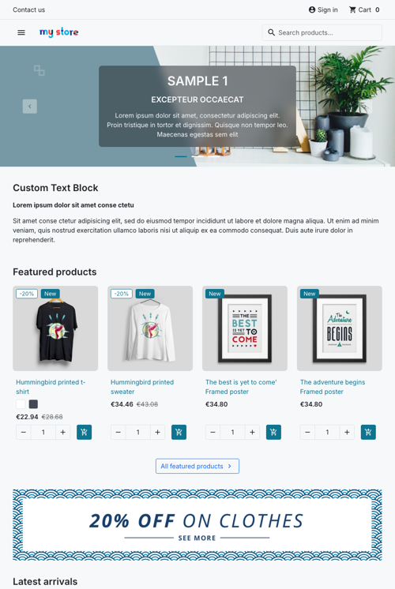

# Hummingbird Child — PrestaShop theme starter


A minimal **wrapper child theme** starter for [Hummingbird](https://github.com/PrestaShop/hummingbird): it builds its **own** `theme.css` / `theme.js` from the parent sources through webpack aliases, instead of inheriting the parent assets at runtime.

No `custom.css`, no `custom.js`: every override is compiled into the main bundles — zero extra HTTP request, and no jQuery in the default bundle.

## 🔍 Theme Preview



## ⚠️ Requirements

- PrestaShop **9.1.x**.
- Hummingbird **2.x** present in `themes/hummingbird` (ships with PrestaShop 9.1 via composer — clone it if missing).
- Node.js **v20.x** or above.

## 📑 Table of Contents

- Want to understand the pattern? Start with [🧬 How it works](#-how-it-works).
- Want to install and enable it? Jump to [🔨 Install](#-install).
- Want to customize it? Jump to [🎨 How to override](#-how-to-override).
- Updating Hummingbird? Read [🔭 Drift after a parent update](#-drift-after-a-parent-update).

## 🧬 How it works

The whole theme fits in **a handful of source files**:

```
config/theme.yml                 Theme declaration, parent, disabled modules
src/scss/theme.scss              SCSS entry — sandwich: variables → parent → child
src/scss/child/_variables.scss   Compile-time Sass overrides (!default variables)
src/scss/child/child.scss        Child styles, loaded last
src/js/theme.ts                  JS entry — mirrors the parent theme.ts, filtered inits
src/js/child/child.ts            Child JS
src/img/{stars,small_stars}.png  Sprites referenced by the parent SCSS (relative path)
templates/catalog/product.tpl    Block-level template override example
webpack.config.js                Single-file webpack config
package.json / tsconfig.json
preview.png
```

Key declarations in `config/theme.yml`:

- `parent: hummingbird` — template fallback chain (child-first resolution).
- `use_parent_assets: false` — the child ships its own CSS/JS bundles.

The webpack aliases (`@js`, `@constants`, `@helpers`, `@services` → `../hummingbird/src/js`) are kept **identical to the parent's own aliases**, so `src/js/theme.ts` stays diff-able against the parent `theme.ts` after every Hummingbird update.

## 🔨 Install

From your PrestaShop root:

```bash
cd themes

# The parent, if not already there (ships with PrestaShop 9.1 via composer)
git clone https://github.com/PrestaShop/hummingbird.git hummingbird

# The child
git clone <repo-url> hummingbird-child
cd hummingbird-child
npm ci
npm run build      # production → assets/css/theme.css + assets/js/theme.js
npm run watch      # or watch mode while developing
```

### ✅ Enable the theme

From the back office: `Design` → `Theme & Logo` → select **Hummingbird Child**.

Or from the CLI, at the PrestaShop root:

```bash
php bin/console prestashop:theme:enable hummingbird-child
```

## 🎨 How to override

### 🎚️ CSS — two levels

1. **Compile-time** — `src/scss/child/_variables.scss`, loaded *before* the parent sources. Works for any variable Bootstrap/Hummingbird leaves as `!default`. Shipped example: `$body-bg`.
2. **Runtime** — `src/scss/child/child.scss`, loaded *last*, using Bootstrap 5.3 CSS custom properties. Shipped example: the brand color (`--bs-primary`, `--bs-link-*`, plus `.btn-primary { --bs-btn-* }` since Bootstrap compiles component colors to literals).

> [!NOTE]
> Hummingbird hard-sets some variables **without** `!default` (`$primary`, `$border-radius`, `$btn-border-radius`, `$font-family-base`…): a Sass override gets clobbered there — use the runtime level instead.

As your overrides grow, split `child.scss` into partials mirroring the parent architecture (`base/`, `components/`, `layout/`, `modules/`, `pages/` — see `themes/hummingbird/src/scss/prestashop/`) and import them from `child.scss`:

```
src/scss/child/
├── _variables.scss
├── child.scss              # @import "components/header"; @import "pages/product"; …
├── components/_header.scss
└── pages/_product.scss
```

### ✂️ Dropping parent CSS

The parent styles are pulled by three imports in `src/scss/theme.scss`. To exclude slices you don't use, replace `@import "@parent-scss/prestashop/index"` with its expanded content (see `themes/hummingbird/src/scss/prestashop/_index.scss`) and cherry-pick. Module partials are listed one per line in `prestashop/modules/_index.scss`, so skipping the CSS of, say, `productcomments` is a one-line removal:

```scss
// Instead of @import "@parent-scss/prestashop/index":
@import "@parent-scss/prestashop/base/index";
@layer ps-components { @import "@parent-scss/prestashop/components/index"; }
@layer ps-modules {
  // Expanded from prestashop/modules/_index.scss, minus the disabled modules
  @import "@parent-scss/prestashop/modules/blockreassurance";
  @import "@parent-scss/prestashop/modules/emailalerts";
  // @import "@parent-scss/prestashop/modules/productcomments";  // disabled module
  // …
}
@layer ps-base { @import "@parent-scss/prestashop/layout/index"; }
@layer ps-pages { @import "@parent-scss/prestashop/pages/index"; }
```

### ⚙️ JS

`src/js/child/child.ts` is called by `theme.ts` after the parent inits.

- To add child behavior: edit `child.ts` — and like the SCSS, split it into modules mirroring the parent layout (`src/js/child/components/`, `src/js/child/modules/`…) once it grows.
- To replace a parent module: swap its import in `theme.ts`.
- To drop a parent module: remove its import/call and leave a comment explaining why (see the `child: dropped inits` comment).

### 🖼️ Templates

Template resolution is child-first with parent fallback — only copy the `.tpl` files you actually change:

- Theme templates → `templates/` (same tree as the parent).
- Module templates → `modules/<module>/views/templates/...`.

Full override example — customize the product flags:

```bash
mkdir -p templates/catalog/_partials
cp ../hummingbird/templates/catalog/_partials/product-flags.tpl templates/catalog/_partials/
# edit templates/catalog/_partials/product-flags.tpl
```

**Block-level override** — no need to copy a whole template to change one part. Smarty templates expose `{block}` sections, and the `parent:` resource lets a child template extend the parent's version and redefine only the blocks it needs. This starter ships a working example, visible on every product page (`templates/catalog/product.tpl`):

```smarty
{extends file='parent:catalog/product.tpl'}

{block name='product_description_short'}
  {$smarty.block.parent}
  <p class="child-badge">Block-level override from the Hummingbird Child theme</p>
{/block}
```

`{$smarty.block.parent}` renders the original block content, so this *appends* instead of replacing. Everything outside the overridden block keeps following the parent template — including future parent updates. (The `.child-badge` style lives in `child.scss`.)

## 🍃 Lightness: disabled modules

`config/theme.yml` disables on activation: `productcomments`, `psgdpr`, `ps_languageselector`, `ps_currencyselector` (plus the ones the parent already disables). Their JS inits are **removed** from `src/js/theme.ts` — see the `child: dropped inits` comment there.

Net result: **no jQuery in the default bundle** (only `productcomments` depended on it).

## 🔭 Drift after a parent update

The child compiles parent sources and copies a few parent files: after every Hummingbird update, audit each layer.

**JS inits** — any new init added to the parent `theme.ts` must be mirrored in ours, unless it drives a disabled module:

```bash
diff <(grep -oE "^import init\w+" ../hummingbird/src/js/theme.ts | sort -u) \
     <(grep -oE "^import init\w+" src/js/theme.ts | sort -u)
```

**SCSS** — the entry sandwich follows the parent's `theme.scss` structure (`abstract` / `vendors` / `prestashop`). If the parent reshuffles its entry or its `_index.scss` files (it happened between PS 9.0 and 9.1), mirror the change — especially if you expanded an `_index` to drop parent CSS (see the *Dropping parent CSS* section above):

```bash
diff ../hummingbird/src/scss/theme.scss src/scss/theme.scss
diff ../hummingbird/src/scss/prestashop/modules/_index.scss <(your expanded list)
```

**Templates** — every copied `.tpl` is frozen at copy time. Diff each override against the parent's current version and replay your changes; `{extends file='parent:...'}` overrides only drift if the parent renames/removes the extended blocks:

```bash
for f in $(find templates -name "*.tpl"); do
  diff -u "../hummingbird/$f" "$f"
done
```

## 📄 License

This theme is released under the [Academic Free License 3.0][AFL-3.0].

[AFL-3.0]: https://opensource.org/licenses/AFL-3.0
